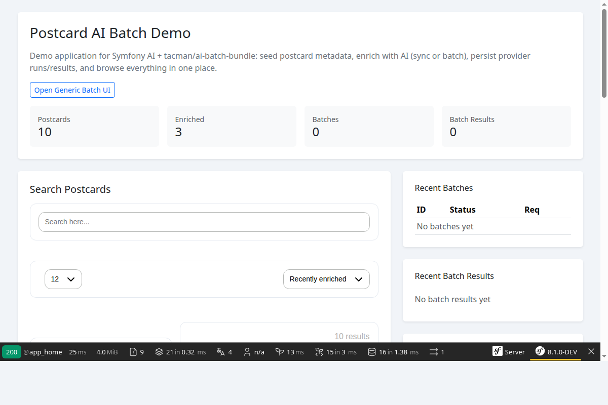
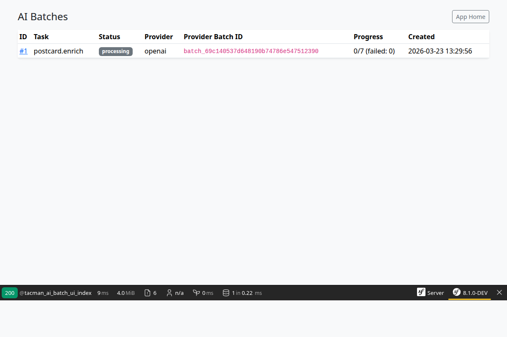
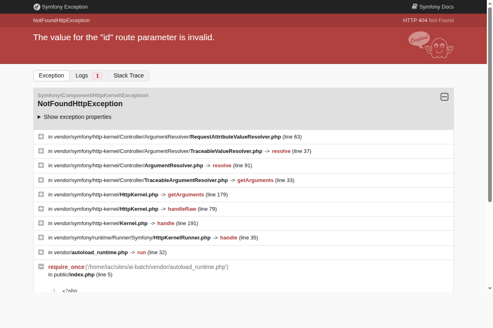

# Postcard AI Batch Demo

Small Symfony demo that:

- loads postcard metadata from JSONL
- enriches postcards with AI description + keywords
- persists batch jobs/results (Tacman bundle)
- provides a simple UI with search + batch visibility

## Requirements

- PHP 8.4+
- Composer
- SQLite (default in `.env`)
- OpenAI API key

## Install

```bash
composer install
```

Set your API key in `.env.local`:

```dotenv
OPENAI_API_KEY=sk-...
```

Create/update database schema:

```bash
php bin/console doctrine:schema:update --force
```

## Data Prep

A small sample of postcards is included in `data/postcards.jsonl`.  
Reference command used to extract a small sample file for this demo (tac's machine only)

```bash
head -n 100 /media/tac/WD-001/mus/data/dc/0p096w19r/20_normalize/obj.jsonl > data/postcards.jsonl
```

## Complete Workflow Example

Here's a complete walkthrough demonstrating the full flow from empty database to enriched data.

### Step 1: Load postcards (images only)

```bash
php bin/console app:load:postcards --reset --image-only
```

This loads postcards with only ID and image URLs (skip metadata). Postcards are marked as `enriched=false`.

### Step 2: Open the UI - you'll see nothing

Start the server:

```bash
symfony serve -d
```

Open `https://127.0.0.1:8000/` - you'll see an empty state with no enriched postcards.

### Step 3: Run sync enrichment on 3 items

```bash
php bin/console app:enrich:postcards --mode=sync --limit=3 -vv
```

The command automatically skips postcards where `enriched=true`. This processes 3 postcards synchronously, generating AI descriptions, keywords, and location (city/state/country).

### Step 4: Open home page - now showing enriched postcards

Refresh `https://127.0.0.1:8000/` - you'll see the 3 enriched postcards with AI-generated descriptions and keywords:



### Step 5: Run batch enrichment on more items

```bash
php bin/console app:enrich:postcards --mode=batch --limit=20
```

This submits postcards to the OpenAI batch API. Already-enriched postcards are skipped.

### Step 6: View batch progress

Check batch status at `https://127.0.0.1:8000/_ai/batches`:



Click on a batch to see progress details:



### Step 7: Reload with full metadata (optional)

After AI processing, reload postcards with full human-provided metadata for comparison:

```bash
php bin/console app:load:postcards
```

## Postcard Status

Each postcard has an `enriched` boolean flag:

| Flag | Meaning |
|------|---------|
| `enriched=false` | Needs AI processing |
| `enriched=true` | AI processing complete |

The enrich command automatically skips enriched postcards. Use `--force` to re-process.

## Commands Reference

| Command | Description |
|---------|-------------|
| `app:load:postcards --reset` | Clear DB and reload all postcards |
| `app:load:postcards --image-only` | Load only ID + image URLs (faster, for AI processing) |
| `app:enrich:postcards --mode=sync` | Process synchronously (returns after completion) |
| `app:enrich:postcards --mode=batch` | Submit to OpenAI batch API (returns immediately) |
| `app:enrich:postcards --force` | Re-process even if already enriched |

## Run the Demo

Start Symfony server:

```bash
symfony serve -d
```

Open:

- `https://127.0.0.1:8000/` - Home page with search
- `https://127.0.0.1:8000/_ai/batches` - Batch status UI

## Recipe Staging

Local recipe staging files live at:

- `recipes/tacman/ai-batch-bundle/0.1`

These are structured to be copied into `symfony/recipes-contrib` when ready.

## Key Files

Core demo logic is intentionally small:

- `src/Entity/Postcard.php`
- `src/Entity/PostcardKeyword.php`
- `src/AiTask/EnrichPostcardAiTask.php`
- `src/Command/LoadPostcardsCommand.php`
- `src/Command/EnrichPostcardsCommand.php`
- `src/Search/PostcardSearch.php`
- `src/Controller/HomeController.php`
- `templates/home/index.html.twig`
- `templates/home/batch_show.html.twig`
- `templates/bundles/MezcalitoUxSearchBundle/Hits.html.twig`
